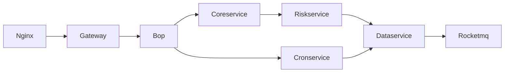
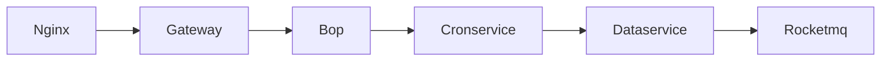
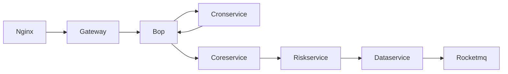

# Space-capsule 太空舱计划

## 项目介绍

Kindling 是一款基于标准化错误定界和定位理念设计的开源监控工具，其设计和核心思路是，对于云上环境和容器环境中，应用程序可能出现的各种故障，能够以标准化的步骤，定位故障出现的位置和原因，而不依赖于用户对应用的了解或对k8s,linux知识的积累。

太空舱计划设计的目的是检验监控工具的标准化故障排查能力，推动Kindling项目的不断演进，以实现对各类故障的覆盖。

项目中总结了一些常见的应用异常场景，这些异常场景由项目组的开发和运维经验整理而来，覆盖了云上项目各类异常场景，包括网络设备，运行资源，应用程序缺陷等多种原因。

这些场景通过预设置的Demo应用和故障注入程序进行封装，可以在各种k8s环境和云主机环境中复现.

用户可以快捷的将自己的测试环境改造成太空舱环境，并部署演示应用，来自行注入故障以验证监控工具的错误检测和定界定位能力。

我们期望Kindling项目能够尽可能地覆盖用户在云上的各种异常场景，欢迎任何有兴趣的开发者参与丰富我们未设想到的缺陷场景，又或是对其他监控工具进行错误检测和定位测，来帮助所有的eBPF监控工具共同进步。

## How to start on K8s

2. 使用 ./install.sh 安装 chaosblade-operator 和 BookDemo示例应用
3. 使用 ./space-capsule case1 创建第一个故障场景
4. 使用 ./space-capsule undo case1 还原第一个故障场景

## 预构建缺陷场景和原因

| No  | 案例原因                      | 案例表现          | 案例类型 | k8s支持 | 云主机支持 |
|-----|---------------------------|---------------|------|----|-------|
| 1   | 主机网卡之间存在高网络延时             | 请求超时/响应慢      | 网络异常 | ✅  | 待开始   |
| 2   | 容器网卡之间存在高网络延时             | 请求超时/响应慢      | 网络异常 | ✅  | NA    |
| 3   | 主机网卡之间存在丢包                | 请求超时/异常返回     | 网络异常 | ✅  | 待开始   |
| 4   | 容器网卡之间存在丢包                | 请求超时/异常返回     | 网络异常 | ✅  | NA    |
| 5   | 集群内网段分配策略错误               | 建立连接失败        | 网络异常 | 待开始 | NA    |
| 6   | 域名解析失败                    | 建立连接失败/无访问请求  | 网络异常 | 实施中 | 待开始   |
| 7   | 由于主机防火墙导致的长tcp连接中断        | 请求超时/请求返回异常   | 网络异常 | 待开始 | 待开始   |
| 8   | 主机节点负载过高，应用程序无法分配到充足的资源   | 请求超时/响应慢      | 资源异常 | ✅  | 待开始   |
| 9   | k8s资源配置不合理，limit无法满足程序需要  | 请求超时/响应慢      | 资源异常 | ✅  | NA    |
| 10  | 容器/主机内部文件打开数达到限制，无法建立更多连接 | 无法建立连接        | 资源异常 | 实施中 | 待开始   |
| 11  | 命名空间资源配额限制，服务无法创建实例       | 无法建立连接        | 资源异常 | 实施中 | 待开始   |
| 12  | Java程序低效代码长时间运行           | 请求超时/响应慢      | 程序缺陷 | 实施中 | 待开始   |
| 13  | Java程序死锁                  | 请求超时/响应慢      | 程序缺陷 | 实施中 | 待开始   |
| 14  | Java程序未捕获异常导致程序致命终止       | 请求异常返回/建立连接失败 | 程序缺陷 | 实施中 | 待开始   |

### 示例应用说明

示例应用是一个基于SpringBoot完成的演示程序，用于模拟正常状态下的用户服务。

#### 示例应用整体调用拓扑

#### 示例应用业务调用链-1

#### 示例应用业务调用链-2

## 能力

- 基于命令行工具，快速构建实验环境。

- 罗列常见的问题场景和导致问题的原因

- 通过注入程序快速复现用户异常场景，并支持快速恢复

- 复现指定原因导致的问题场景

## 工作原理

- 网络类故障： 基于chaosblade封装的网络故障注入工具，底层为tc命令实现
- 资源类故障： 基于chaosblade和k8s api-server实现应用的资源控制和节点的资源控制 
- 应用代码类故障： 基于chaosblade的JVM代码注入工具
- 权限和策略故障： 基于k8s api-server和示例应用内部逻辑

## 缺陷注入

- [x] 支持出网和入网流量延迟和丢包场景，支持以下粒度: node,workload,pod,containers
- [x] 支持资源抢占场景，包括 cpu，mem和disk资源, 支持以下粒度: node,workload,pod,containers
- [x] 支持k8s资源限制场景，包括cpu，memory和ephemeral storage的requests，limit限制
- [ ] 支持Java应用程序异常场景，包括死锁，资源异常使用，RuntimeError, 外部资源阻塞等情况