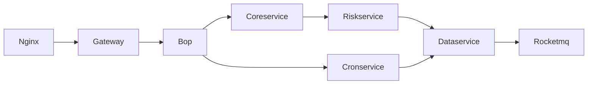
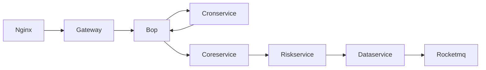

# Space-capsule 太空舱计划

## 项目介绍

Kindling 是一款基于标准化错误定界和定位理念设计的开源监控工具，其设计和核心思路是，对于云上环境和容器环境中，应用程序可能出现的各种故障，能够以标准化的步骤，定位故障出现的位置和原因，而不依赖于用户对应用的了解或对k8s,linux知识的积累。

太空舱计划设计的目的是检验监控工具的标准化故障排查能力，推动Kindling项目的不断演进，以实现对各类故障的覆盖。

项目中总结了一些常见的应用异常场景，这些异常场景由项目组的开发和运维经验整理而来，覆盖了云上项目各类异常场景，包括网络设备，运行资源，应用程序缺陷等多种原因。

这些场景通过预设置的Demo应用和故障注入程序进行封装，可以在各种k8s环境和云主机环境中复现.

用户可以快捷的将自己的测试环境改造成太空舱环境，并部署演示应用，来自行注入故障以验证监控工具的错误检测和定界定位能力。

我们期望Kindling项目能够尽可能地覆盖用户在云上的各种异常场景，欢迎任何有兴趣的开发者参与丰富我们未设想到的缺陷场景，又或是对其他监控工具进行错误检测和定位测，来帮助所有的eBPF监控工具共同进步。

## How to start on K8s
### k8s版本支持
    v1.18.1 -> 1.23.1 已验证
    其他版本如不适配，请提issues,提pr更加欢迎
### k8s开始 
1. 下载release到master节点(保证能执行kubectl命令即可)之后解压 
2. 创建演示namespace -> kubectl create namespace practice
3. cd space-capsule目录,执行./install.sh安装 [chaosblade-operator](https://github.com/chaosblade-io/chaosblade-operator) 和 示例应用
- 执行 kubectl get po -n chaosblade 可查看chaosblade-operator是否安装成功
```

NAME                                   READY   STATUS    RESTARTS   AGE
chaosblade-operator-748dc7588b-z9kts   1/1     Running   1          5d22h
chaosblade-tool-69whc                  1/1     Running   3          12d
chaosblade-tool-8jrxx                  1/1     Running   1          12d
chaosblade-tool-8mcjx                  1/1     Running   1          4d23h
chaosblade-tool-987fq                  1/1     Running   3          12d
chaosblade-tool-ksw9w                  1/1     Running   2          12d
chaosblade-tool-mwt76                  1/1     Running   1          12d
```
- 执行 kubectl get po -n practice 
可查看示例应用是否安装成功
```

NAME                             READY   STATUS             RESTARTS   AGE
bop-67bddbd49-n5nzf              1/1     Running            0          20h
configservice-7f67b8846d-4h6kv   1/1     Running            0          3h49m
configservice-fbcb85d77-8zqhb    1/1     Running            0          3h56m
coreservice-5779d97d6b-4hhs8     1/1     Running            0          3h51m
cronservice-77dbf765f9-zfsrp     1/1     Running            0          4h7m
dataservice-96d785bdc-r7lww      1/1     Running            0          3h51m
etcs-7b9d99bbb5-vs2ng            1/1     Running            0          3h50m
gateway-f5c68b974-z4vcm          1/1     Running            0          3h50m
ng-b76f67475-2qwth               1/1     Running            0          3h50m
riskservice-78956c8bf8-8ckqx     1/1     Running            0          3h49m
rocketmq-0                       1/1     Running            0          4h
```
3.  ng为入口应用，默认通过ingress-nginx(需自配) 暴露ng-svc的端口，如果没有ingress-nginx可将ng-svc修改为nodePort形式

```
[root@10 space-capsule-alpha]# kubectl get svc -n practice
NAME           TYPE        CLUSTER-IP      EXTERNAL-IP   PORT(S)    AGE
bop-svc        ClusterIP   10.99.95.76     <none>        8080/TCP   35d
core-svc       ClusterIP   10.96.122.223   <none>        8080/TCP   35d
cron-svc       ClusterIP   10.108.84.197   <none>        8080/TCP   34d
data-svc       ClusterIP   10.99.95.79     <none>        8080/TCP   35d
etcs-svc       ClusterIP   10.99.95.80     <none>        8080/TCP   35d
gateway-svc    ClusterIP   10.99.95.75     <none>        8080/TCP   35d
ng-svc         ClusterIP   10.99.95.71     <none>        8080/TCP   36d
risk-svc       ClusterIP   10.99.95.78     <none>        8080/TCP   35d
rocketmq-svc   ClusterIP   10.99.95.77     <none>        8080/TCP   5d20h
```

3. 使用 ./space-capsule case1 创建第一个故障场景 

```
[root@10 space-capsule-alpha]# ./space-capsule case12 --namespace practice --pod coreservice-67dd66b57c-hsm2b
Check result True
Chaosblade Exist
Copy file finished
['bash', '-c', '/opt/chaosblade/blade prepare jvm  --process java    ']
{"code":200,"success":true,"result":"01aa8dca66762cf7"} None
agent ['01aa8dca66762cf7']
slow_code injected done！
```
4. 使用 ./space-capsule undo case1 还原第一个故障场景

```
[root@10 space-capsule-alpha]# ./space-capsule undo case12
{"code":200,"success":true,"result":{"target":"jvm","action":"delay","flags":{"classname":"com.imooc.appoint.service.Impl.PracticeServiceImpl","methodname":"httpTxn1","offset":"100","process":"java","time":"3000"}}}
```

## How to start on vm
1. 下载release到主机节点之后解压
2. cd space-capsule目录
3. 使用 ./space-capsule case1-vm 创建第一个故障case，虚机加后缀-vm

```
[root@nginx space-capsule-alpha]# ls
example  history  install.sh  space-capsule
[root@nginx space-capsule-alpha]# ./space-capsule case1-vm

```
4.  使用 ./space-capsule undo case1 还原第一个故障场景

```
[root@nginx space-capsule-alpha]# ./space-capsule undo case1-vm
{"code":200,"success":true,"result":{"target":"network","action":"delay","flags":{"interface":"ens192","local-port":"8080,8081","offset":"100","time":"2000"}}}
```
## 流量发送
### k8s jemter脚本及使用
1. 位于/space-capsule/jemter文件夹下面
2. 修改用户定义的变量中ngIp,ngport为nginx暴露的端口或者nodeport方式暴露的端口
3. 下发配置
- 禁用start线程组，启用init线程组，执行。查看结果树，每个请求项data不为空表示配置下发成功。
```
{
    "data": {
        "mysql_resp_interval": "-1",
        "get_http_url1": "http:\/\/gateway-svc:8080\/bookDemo\/gateway\/practice\/httpTxn1",
        "get_http_url2": "http:\/\/gateway-svc:8080\/bookDemo\/gateway\/practice\/httpTxn1",
        "get_http_url3": "http:\/\/gateway-svc:8080\/bookDemo\/gateway\/practice\/httpTxn1",
        "get_http_url4": "http:\/\/gateway-svc:8080\/bookDemo\/gateway\/practice\/httpTxn2And4",
        "http_error_resp_code": "200",
        "http_resp_interval": "10"
    },
    "success": true,
    "Connection": "keep-alive"
}
```
4. 发送流量
- 禁用init线程组，启用start线程组，执行，查看执行结果树：

```
{
    "data": {
        "result": "Success",
        "data": "{\"data\":{\"result\":\"Success\",\"d`...`"}",
        "status": 200
    },
    "success": true,
    "Connection": "keep-alive"
}
```

### vm jemter脚本及使用
- 待开始
## 预构建缺陷场景和原因

| No     | 案例原因                      | 案例表现          | 案例类型    | k8s支持 | 云主机支持 |
|--------|---------------------------|---------------|---------|-------|-------|
| case1  | 主机网卡之间存在高网络延时             | 请求超时/响应慢      | 网络异常    | ✅     | ✅     |
| case2  | 容器网卡之间存在高网络延时             | 请求超时/响应慢      | 网络异常    | ✅     | NA    |
| case3  | 主机网卡之间存在丢包                | 请求超时/异常返回     | 网络异常    | ✅     | ✅     |
| case4  | 容器网卡之间存在丢包                | 请求超时/异常返回     | 网络异常    | ✅     | NA    |
| case5  | 集群内网络隔离                   | 建立连接失败        | 网络异常    | ✅     | NA    |
| case6  | 域名解析失败                    | 建立连接失败/无访问请求  | 网络异常    | ✅     | 待开始   |
| case7  | 由于主机防火墙导致的长tcp连接中断        | 请求超时/请求返回异常   | 网络异常    | 待开始   | 待开始   |
| case8  | 主机节点负载过高，应用程序无法分配到充足的资源   | 请求超时/响应慢      | 资源异常    | ✅     | ✅     |
| case9  | k8s资源配置不合理，limit无法满足程序需要  | 请求超时/响应慢      | 资源异常    | ✅     | NA    |
| case10 | 容器/主机内部文件打开数达到限制，无法建立更多连接 | 无法建立连接        | 资源异常    | 实施中   | 待开始   |
| case11 | 命名空间资源配额限制，服务无法创建实例       | 无法建立连接        | 资源异常    | ✅     | NA    |
| case12 | Java程序低效代码长时间运行           | 请求超时/响应慢      | 程序缺陷    | ✅     | 待开始   |
| case13 | Java程序死锁                  | 请求超时/响应慢      | 程序缺陷    | ✅     | ✅     |
| case14 | Java程序未捕获异常导致程序致命终止       | 请求异常返回/建立连接失败 | 程序缺陷    | ✅     | ✅     |
| case15 | 磁盘io慢                     | 请求处理缓慢        | 资源异常    | 实施中   | 待开始   |
| case16 | 应用程序使用的线程池资源耗尽            | 业务请求超时        | 资源异常    | 待开始   | 待开始   |
| case17 | Java程序使用的内存资源超过Xmx限制      | 请求异常          | 资源异常    | 待开始   | 待开始   |
| case18 | 应用程序中使用的Sql语句执行时间过久       | 请求超时 ｜资源异常    | 待开始｜待开始 |


### 示例应用说明

示例应用是一个基于SpringBoot完成的演示程序，用于模拟正常状态下的用户服务。

#### 示例应用整体调用拓扑



#### 示例应用业务调用链-1


#### 示例应用业务调用链-2



## 能力

- 基于命令行工具，快速构建实验环境。
- 罗列常见的问题场景和导致问题的原因
- 通过注入程序快速复现用户异常场景，并支持快速恢复
- 复现指定原因导致的问题场景

## 工作原理

- 网络类故障： 基于chaosblade封装的网络故障注入工具，底层为tc命令实现
- 资源类故障： 基于chaosblade和k8s api-server实现应用的资源控制和节点的资源控制 
- 应用代码类故障： 基于chaosblade的JVM代码注入工具
- 权限和策略故障： 基于k8s api-server和示例应用内部逻辑

## 缺陷注入

- 支持出网和入网流量延迟和丢包场景，支持以下粒度: node,workload,pod,containers
- 支持资源抢占场景，包括 cpu，mem和disk资源, 支持以下粒度: node,workload,pod,containers
- 支持k8s资源限制场景，包括cpu，memory和ephemeral storage的requests，limit限制
- 支持Java应用程序异常场景，包括死锁，资源异常使用，RuntimeError, 外部资源阻塞等情况
