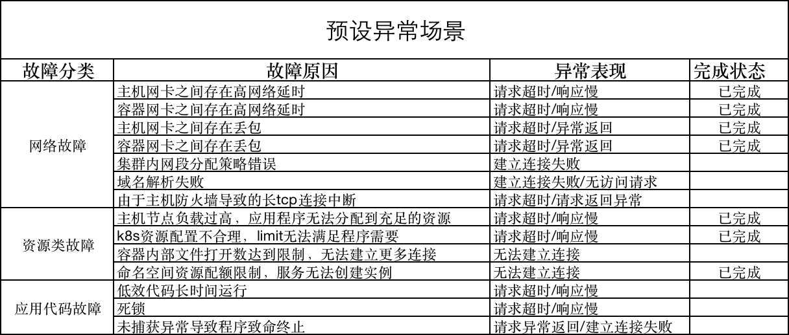

# Space-capsule 太空舱计划

## 项目介绍

Kindling 是一款基于标准化错误定界和定位理念设计的开源监控工具，其设计和核心思路是，对于云上环境和容器环境中，应用程序可能出现的各种故障，能够以类似排查手册的方式，定位故障出现的位置和原因，而不依赖于用户对应用的了解或对k8s,linux知识的积累。

太空舱计划设计的目的是检验监控工具的标准化故障排查能力，推动Kindling项目的不断演进，以实现对各类故障的覆盖。

项目中总结了一些常见的应用异常场景，这些异常场景由项目组的开发和运维经验整理而来，覆盖了云上项目各类异常场景，包括网络设备，运行资源，应用程序缺陷等多种原因。

这些场景通过预设置的Demo应用和故障注入程序进行封装，可以在各种k8s环境中复现。

用户可以快捷的将自己的测试环境改造成太空舱环境，并部署演示应用，来自行注入故障以验证监控工具的错误检测和定界定位能力。

我们欢迎任何有兴趣的开发者参与丰富我们的缺陷场景，又或是对其他监控工具进行错误检测和定位测试。

## 能力

- 基于命令行工具，快速构建实验环境。

- 罗列常见的问题场景和导致问题的原因

- 通过注入程序快速复现用户异常场景，并支持快速恢复

- 复现指定原因导致的问题场景

## 工作原理

- 网络类故障： 基于chaosblade封装的网络故障注入工具，底层为tc命令实现
- 资源类故障： 基于chaosblade和k8s api-server实现应用的资源控制和节点的资源控制 
- 应用代码类故障： 基于chaosblade的JVM代码注入工具
- 权限和策略故障： 基于k8s api-server和示例应用内部逻辑

## 缺陷注入

- [x] 支持出网和入网流量延迟和丢包场景，支持以下粒度: node,workload,pod,containers
- [x] 支持资源抢占场景，包括 cpu，mem和disk资源, 支持以下粒度: node,workload,pod,containers
- [x] 支持k8s资源限制场景，包括cpu，memory和ephemeral storage的requests，limit限制
- [ ] 支持Java应用程序异常场景，包括死锁，资源异常使用，RuntimeError, 外部资源阻塞等情况

## 预构建缺陷场景和原因

